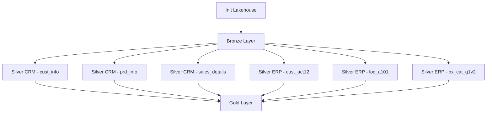

# 🏗️ Data Lakehouse on Databricks

A complete, professional implementation of a **Lakehouse architecture** using Databricks, structured into **Bronze, Silver, and Gold** layers and developed as part of the *Data with Baraa – Databricks Bootcamp*. The project processes bike sales data and includes a fully orchestrated ETL pipeline triggered automatically when new files arrive in the raw volume.

---

## 📂 Project Structure
```
datawithbaraa_databricks_bootcamp/
├── bronze/                  # Raw data ingestion (Delta tables)
├── silver/                  # Clean & standardized transformations
│   ├── crm/                 # CRM domain transformations
│   └── erp/                 # ERP domain transformations
├── gold/                    # Curated analytical models
└── init_lakehouse.ipynb     # Initial lakehouse configurations
```

---

## 🔧 Tech Stack
- Databricks Lakehouse Platform
- Apache Spark / PySpark
- Delta Lake
- Python
- Git & GitHub

---

## 🔄 Pipeline Overview
- **Bronze:** Load raw datasets into Delta format.
- **Silver:** Apply cleaning, normalization, schema enforcement, and deduplication.
- **Gold:** Produce optimized, analytics‑ready tables for BI and downstream consumption.

---

## ⚙️ Lakehouse Initialization (SQL)
```sql
USE CATALOG workspace;

CREATE SCHEMA IF NOT EXISTS bronze
COMMENT 'Bronze layer: raw ingested data';

CREATE SCHEMA IF NOT EXISTS silver
COMMENT 'Silver layer: cleaned and transformed data';

CREATE SCHEMA IF NOT EXISTS gold
COMMENT 'Gold layer: business-ready data';

CREATE VOLUME IF NOT EXISTS workspace.bronze.source_system
COMMENT 'Volume for raw source files (CSV)';
```

---

# 1️⃣ Architecture Diagram


---

# 2️⃣ Job Orchestration Overview
The ETL pipeline is orchestrated using a **Databricks Job** composed of multiple serverless tasks:

### **Tasks included:**
- `init_lakehouse` – prepares schemas, volumes, and catalog
- `bronze_layer` – ingests raw CSV files into Delta tables
- `silver_crm_*` – transforms CRM domain datasets
- `silver_erp_*` – transforms ERP domain datasets
- `gold_layer` – produces final analytical models

### **Job features:**
- Fully serverless execution
- Task dependencies ensuring correct order
- Centralized logging and monitoring
- Email notifications on success or failure

---

# 3️⃣ Triggering Mechanism
The job is automatically triggered when new files are added to the raw volume:

```
workspace.bronze.raw_sources
```

This enables near‑real‑time ingestion and processing without manual intervention.

---

## 🚀 Execution
1. Import notebooks into Databricks.
2. Attach to a DBR 14+ cluster.
3. Run notebooks in order: **Bronze → Silver → Gold**.
4. Or rely on the automated job trigger for full orchestration.

---

## 📌 Summary
This repository implements a production‑ready Lakehouse with:
- Multi‑layer Delta architecture
- Domain‑oriented Silver transformations
- Automated orchestration with triggers and notifications
- A clear, scalable structure for future enhancements
